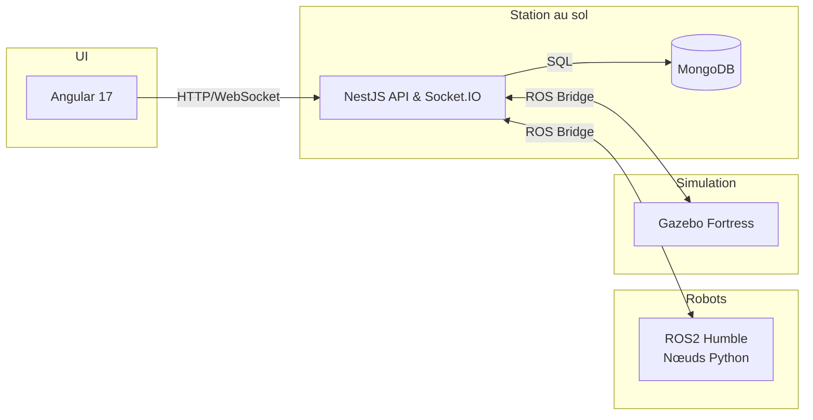
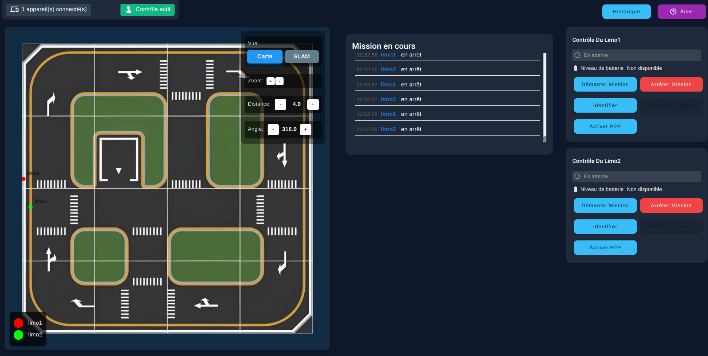
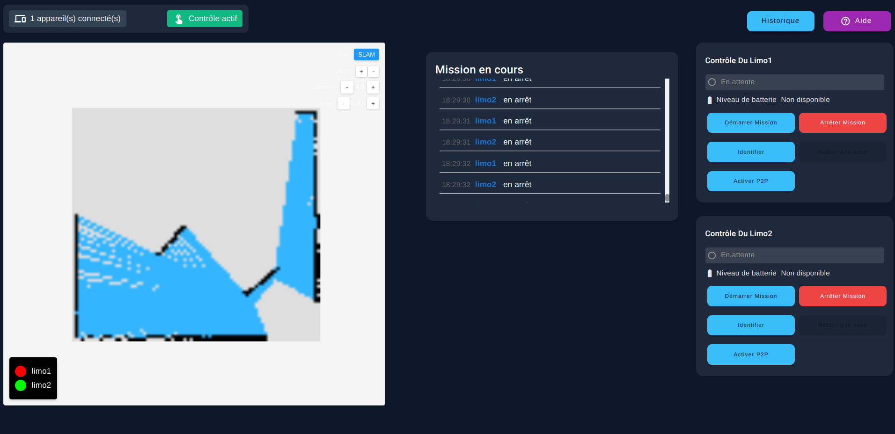
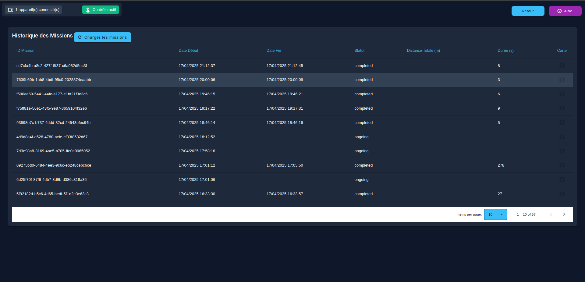
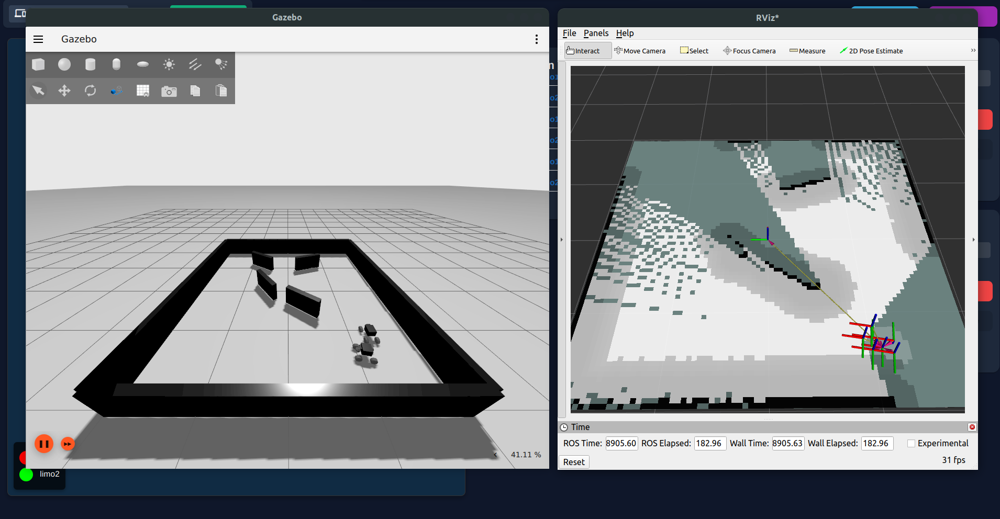

# 🤖 Système d’exploration multi‑robot - AgileXplorer
[](#)  
[](#) 
[](#) 
[](#) 
[](#) 
[](#) 
[](#) 
[](#) 
[](#)

> Projet réalisé dans le cadre du cours **INF3995 – Hiver 2025** à l'École Polytechnique de Montréal.  
> **Objectif** : démontrer la faisabilité technique d’une mission d’exploration autonome par **deux robots AgileX Limo** se coordonnant via une station au sol et une simulation Gazebo.  
> **Mise en situation** : Appel d'offre de la **NASA** et réponse à ce dernier avec des processus identiques en industrie.

---

## 📑 Table des matières
1. [Présentation rapide](#présentation-rapide)
2. [Fonctionnalités principales](#fonctionnalités-principales)
3. [Exigences (requis) couvertes](#exigences-requis-couvertes)
4. [Architecture & technologies](#architecture--technologies)
5. [Structure du dépôt](#structure-du-dépôt)
6. [Installation & lancement](#installation--lancement)
7. [Tests](#tests)
8. [Captures d’écran](#captures-décran)
9. [Feuille de route](#feuille-de-route)
10. [Équipe](#équipe)
11. [Licence](#licence)

---

## Présentation rapide
Le système complète trois environnements :

| Composante | Rôle | Pile techno |
|------------|------|-------------|
| **Robots** | Navigation, cartographie, P2P | ROS 2 Humble + Python |
| **Station** | Orchestration, API, stockage | NestJS · MongoDB · Socket.IO |
| **Simulation** | Tests sans matériel | Gazebo Fortress · ros_gz_bridge |

Une **interface Angular** unifie le contrôle, la visualisation temps réel (≥ 1 Hz) et l’historique des missions.

---

## Fonctionnalités principales
- ⚡ **Identification** individuelle visuelle/sonore (`R.F.1`)
- 🚀 **Lancement / arrêt de mission** depuis le Web (`R.F.2`)
- 🗺️ **Exploration autonome** & **évitement d’obstacles** (`R.F.4`, `R.F.5`)
- 🛰️ **Cartographie 2D** et superposition de la position des robots (`R.F.8`, `R.F.9`)
- 🔋 **Retour automatique à la base** (manuel ou batterie < 30 %) (`R.F.6`, `R.F.7`)
- 🔄 **Communication P2P** : partage de la distance à la base (`R.F.19`)
- 📚 **Journalisation** continue & base de données PostgreSQL (`R.C.1`, `R.F.17`)

---

## Exigences (requis) couvertes
<details>
<summary>▶️ Cliquer pour la liste complète</summary>

### Requis généraux  
- **R.G.1** Exploration autonome multi‑robot  
- **R.G.2** Supervision via station au sol  

### Requis matériels  
- Robots AgileX Limo, Wi‑Fi dédié, capteurs fournis, station PC  

### Requis logiciels  
- Ubuntu 22.04 (+ ROS 2), interface unique simulation ↔ réel, Docker partout sauf sur robots  

### Requis fonctionnels (prioritaires)  
`R.F.1` à `R.F.20` — détaillés ci‑dessus et dans la documentation du projet  

### Requis de conception  
- **Logs continus**, **lancement en une commande**, **UI Nielsen‑10**, compatibilité 1‑2 robots  

### Requis de qualité  
- Conventions de code (ESLint, Prettier, Black, ament_lint)  
- Couverture de tests unitaires / procédures pour chaque module  
</details>

---

## Architecture & technologies


### Pile principale
| Couche   | Technologie                       | Raison                                   |
|----------|-----------------------------------|------------------------------------------|
| Frontend | **Angular 17**, SCSS             | SPA réactive                             |
| Backend  | **NestJS 10**, TypeScript        | API REST + WebSocket modulaire           |
| Données  | **MongoDB 15**                   | Intégrité & journalisation               |
| Embarqué | **ROS 2 Humble**, Python 3.11    | Standard robotique, modularité par nœuds |
| CI/CD    | GitLab CI, Docker Compose        | Reproductibilité, lancement 1‑click      |

---

## Structure du dépôt

```
.
├── client/                     # Interface utilisateur Angular
├── server/                     # Serveur NestJS
├── robot/
│   ├── common/                 # Fichiers partagés entre robots (son, images, ...)
│   ├── gazebo/                 # Modèles et monde Gazebo
│   ├── gazebo_launch_scripts/  # Scripts pour le lancement séparé de la simulation
│   ├── limo/                   # Code spécifique au robot Limo
│   ├── limo_launch_scripts/    # Scripts pour le lancement séparé des limos
│   ├── robot/                  # Comportement embarqué des robots (navigation, communication, identification, ...)
│   ├── robot_launch_scripts/   # Scripts pour le lancement séparé de comportement embarqué
│   └── utilities/              # Scripts d'installation, débogage
├── docker-compose.yml          # Lancement station avec Docker
├── Dockerfile                  # Construction du conteneur
├── start_base.sh               # Script de démarrage de la station au sol (Fronend, Backend)
├── start_docker.sh             # Lance l'environnement complet avec Docker
├── start_gazebo.sh             # Lance simulation Gazebo (Frontend, Backend, Gazebo)
├── start_install.sh            # Installe dépendances nécéssaires
├── START.md                    # Instructions d’utilisation (voir ci-dessous)
```

---

## Installation & lancement
### Prérequis
- **Ubuntu 22.04** (ou WSL 2)  
- Docker ≥ 24, Docker Compose V2  
- Python 3.11, Node 20, Yarn (ou npm 9)

### Démarrage rapide
```bash
git clone https://gitlab.com/polytechnique-montr-al/inf3995/20251/equipe-102/INF3995-102.git
cd inf3995
./start_base.sh                               # Station au sol + UI + DB
./robot/limo_launch_scripts/start-all-1.sh      # Robot 1
./robot/limo_launch_scripts/start-all-2.sh      # Robot 2
```

## Tests
| Niveau             | Commande            | Outil                        |
|--------------------|---------------------|------------------------------|
| Unitaire (front)   | `npm test`          | Karma + Jasmine              |
| Unitaire (back)    | `npm run test`      | Jest                         |
| ROS2 Python        | `pytest`            | PyTest + launch_testing      |
| End‑to‑End (E2E)   | `npx cypress run`   | Cypress                      |
| Intégration ROS2   | `ros2 test`         | launch_testing               |

Le pipeline GitLab exécute l’ensemble des tests à chaque *merge request*.

---

## Captures d’écran

### Interface Web
<p align="center">
  
</p>

### Carte temps réel
<p align="center">
  
</p>

### Base PostgreSQL
<p align="center">
  
</p>

### Simulation Gazebo
<p align="center">
  
</p>

---

## Feuille de route
-  🔧 Algorithme d’exploration coopérative (planification de couverture)  
-  📱 Mode hors‑ligne de l’interface avec replay de mission  
-  🛡️ Zone de sécurité dynamique (geo‑fence) `R.F.20`  
-  🎮 Support ≤ 2 robots et coordination par rôles  

---

## Équipe
| Rôle            | Nom                                                         |
|-----------------|-------------------------------------------------------------|
| Scrum Master    | **Kevin Santiago Gratton Fournier**                         |
| Product Owner   | **Issam Haddadi**                                           |
| Dev & Robotique | Issam Haddadi · Kevin Santiago Gratton Fournier · Amine Zerouali · Rafik Hachemi Boumila · Yassine Abassi · Mario Junior Milord |

---

## Licence
Distribué sous licence **MIT** – voir `LICENSE`.
